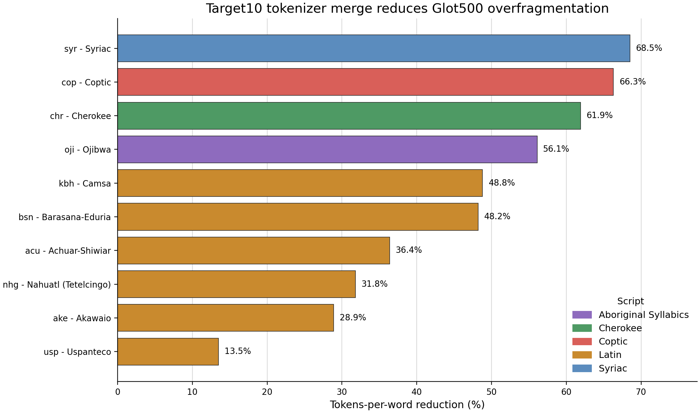

# Paper Figures Draft

작성일: 2026-06-04

## Figure 1. Target10 Tokenizer Merge Reduces Glot500 Overfragmentation

Artifacts:

- PNG: `figures/target10_tokenization_reduction.png`
- SVG: `figures/target10_tokenization_reduction.svg`
- Source table: `figures/target10_tokenization_reduction.tsv`

Main reading:

- The largest tokens-per-word reductions are in the non-Latin scripts: Syriac 68.5%, Coptic 66.3%, Cherokee 61.9%, and Ojibwa 56.1%.
- Latin-script target languages also improve, but the effect is less uniform.
- This figure supports the tokenizer-bottleneck claim independently of downstream NMT quality.

Suggested caption:

> Tokens-per-word reduction after merging a target10 SentencePiece vocabulary into the Glot500 tokenizer. The largest gains appear in scripts that were most overfragmented by the original tokenizer, especially Syriac, Coptic, Cherokee, and Ojibwa.
