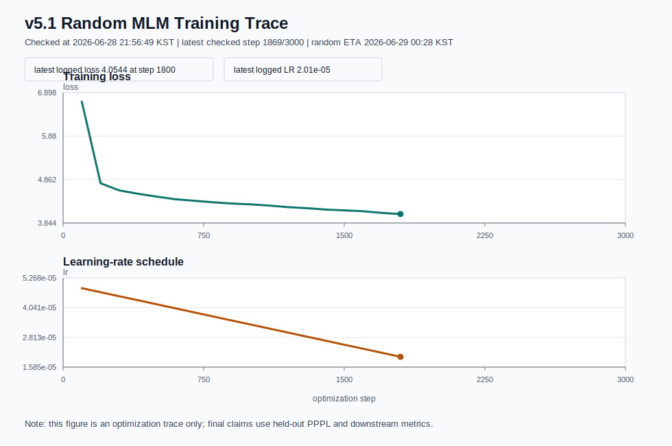

# v5.1 발표 자료 구성안

## Slide 1. 문제 설정

- Glot500-style reproduction을 92 XLM-R seen + genuine low-resource target10으로 제한해 재현한다.
- Vocabulary extension 이후 새 token embedding initialization이 성능에 미치는 영향을 본다.
- Final line은 v5 low-resource target10이고, v5.1은 downstream-aware diagnostic이다.

Speaker note:

- 목표는 Glot500 전체 500개 언어 재현이 아니라, 방법론을 지키는 축소 재현이다.
- Novelty는 vocabulary를 늘리는 행위 자체보다, 늘어난 token의 embedding을 어떻게 시작하느냐에 있다.

## Slide 2. 왜 v5인가

- v5 target10은 모두 corpus-size 기준 genuine low-resource XLM-R-unseen 언어다.
- v5 target10은 공식 task-list membership이 일부 있으나, local tail materialization
  repair 전에는 downstream improvement claim을 하지 않는다.
- v5.1은 downstream-aware로 target을 고르면 mid/high-resource로 이동한다는 diagnostic이다.

핵심 메시지:

```text
v5 = main low-resource experiment
v5.1 = downstream-aware diagnostic / ablation
```

데이터 및 언어 선택 상세 발표 섹션:

```text
02_slides/data_language_selection_ppt_ko.md
```

## Slide 3. Target10 선택

```text
guj_Gujr, asm_Beng, srp_Cyrl, sun_Latn, zsm_Latn,
aze_Latn, fil_Latn, bos_Latn, dzo_Tibt, sat_Olck
```

- 모두 XLM-R-unseen.
- downstream coverage와 지역/문자 다양성을 함께 고려.

## Slide 4. 데이터 및 평가 Coverage

| Metric | Total | Head | Target10 |
| --- | ---: | ---: | ---: |
| PPPL | 102 | 92 | 10 |
| Tatoeba | 66 | 63 | 3 |
| Bible | 80 | 74 | 6 |
| NER | 84 | 78 | 6 |
| Roundtrip | 80 | 74 | 6 |
| POS | 58 | 58 | 0 |
| Taxi1500 | 1 | 1 | 0 |

## Slide 5. Tokenizer 확장

- Base vocab: 250,002
- Extended vocab: 370,051
- Added tokens: 120,049
- Audit failures: 0

## Slide 6. Novelty: Embedding Initialization

| Method | 핵심 |
| --- | --- |
| Random | 새 token embedding random initialization |
| FVT | source-token decomposition 기반 initialization |

같은 corpus/tokenizer/batch/step으로 matched pair 비교.

## Slide 7. Training 현황

- strict 5% corpus: 8,130,401 lines
- 3-GPU fallback: GPU 0,1,3
- effective batch: 384
- random 3K run stopped: 1869/3000 at 2026-06-28 21:56 KST
- latest observed loss: 4.0544 at step 1800
- training curve figure: `4_reporting/01_figures/training_loss_lr.svg`
- FVT는 시작되지 않음
- final checkpoint가 없어서 evaluation은 실행하지 않음



Training setting:

| Field | Value |
| --- | --- |
| Optimizer | AdamW |
| Initial LR | 5e-5 |
| Batch | 384 |
| Seq length | 512 |
| Max steps | 3,000 x 2 initializers |

## Slide 8. Glot500-style Evaluation

- PPPL: held-out test
- Tatoeba/Bible retrieval: layer 8 mean embedding, cosine Top-10
- NER/POS/Taxi1500: fine-tune then zero-shot/test
- Roundtrip: Bible-based alignment accuracy

## Slide 9. 결과 표

결과 삽입 위치:

```text
docs/exp/v5.1/3_evaluation/09_aggregation/main_head_tail_all.tsv
docs/exp/v5.1/3_evaluation/09_aggregation/v5_target_subset.tsv
docs/exp/v5.1/4_reporting/00_tables/table_03_main_metric_results.md
docs/exp/v5.1/4_reporting/00_tables/table_06_metric_completion.md
```

표는 `head`, `target10`, `all`로 분리한다.

Main result table shape:

| Metric | Random head | FVT head | Random target10 | FVT target10 | Interpretation |
| --- | ---: | ---: | ---: | ---: | --- |
| PPPL | pending | pending | pending | pending | lower is better |
| Tatoeba Top-10 | pending | pending | pending | pending | higher is better |
| Bible Top-10 | pending | pending | pending | pending | higher is better |
| NER F1 | pending | pending | pending | pending | higher is better |
| Roundtrip Acc. | pending | pending | pending | pending | higher is better |

주의:

- POS/Taxi1500은 target10 coverage가 없으므로 target-side claim에서 제외한다.
- XLM-R Base와 Glot500 Base는 baseline/reference column으로 추가한다.

## Slide 10. Similarity / 2D Map

- layer 8 mean pooling sentence embedding
- same-language / same-meaning / roundtrip pair similarity
- UMAP 또는 t-SNE 2D point map
- current input: 22,600 sentence pairs
- output: `similarity_summary.tsv`, `embedding_map_2d.png`
- report/PPT table: `4_reporting/00_tables/table_04_similarity_results.md`

해석 질문:

| Question | What to show |
| --- | --- |
| 같은 언어끼리 더 잘 모이는가 | same-language cosine, 2D cluster |
| 같은 의미의 문장이 가까운가 | Tatoeba/Bible aligned cosine |
| pivot을 거쳐도 의미가 유지되는가 | roundtrip source-English/source-pivot cosine |

## Slide 11. Claim Boundary

- v5.1 held-out PPPL만 final PPPL로 사용.
- v5 train-source PPPL은 diagnostic/fallback.
- POS와 Taxi1500은 target10 claim 없음.

## Slide 12. 결론

- Glot500-style split discipline을 회복했다.
- downstream-aware target10으로 target-side evidence를 확보했다.
- random vs FVT 비교로 vocab extension initialization novelty를 평가한다.

결과가 나온 뒤 결론 문장 후보:

```text
If FVT > Random:
FVT-style source-token decomposition gives a measurable advantage for new-token
initialization under strict Glot500-style held-out evaluation.

If FVT ~= Random:
Tokenizer expansion and continued MLM dominate over initialization choice in
this 5%/3K budget, while FVT remains a low-risk initialization strategy.

If FVT < Random:
Source-token decomposition is not automatically beneficial; target language
script/token composition and training budget need more careful conditioning.
```
