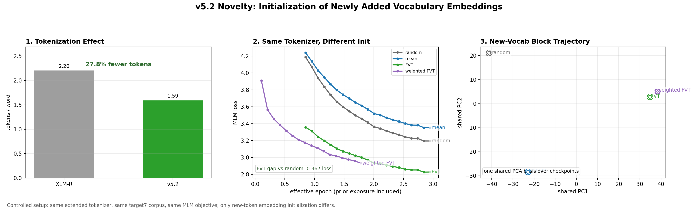

# v5.2 Novelty Summary

## PPT 핵심 메시지

- v5.2 tokenizer extension은 target7의 subword fertility를 낮춰 tail-language 문장을 더 짧은 token sequence로 표현하게 만든다.
- 하지만 이 실험의 핵심 novelty는 tokenizer 확장 자체가 아니다.
- 모든 initialization variant는 같은 extended tokenizer, 같은 target7 corpus, 같은 MLM objective, 같은 evaluation protocol을 공유한다.
- 통제된 차이는 newly added vocabulary embedding rows, 즉 new-vocab embedding block의 초기화 방식이다.
- FVT 계열 초기화는 random/mean보다 낮은 MLM loss로 더 빠르게 내려가며, 이는 더 좋은 출발점이 optimization head-start를 준다는 증거다.
- shared-basis new-vocab trajectory에서 method별 경로가 바로 하나로 collapse되지 않으므로, initialization effect가 학습 초반 noise로만 사라지는 현상은 아니다.

## 슬라이드 한 줄 설명

- 같은 tokenizer, 같은 data, 같은 loss에서도 new-token embedding initialization이 달라지면 학습 trajectory와 loss gap이 달라진다.

## 현재 결과 해석

- Tokenization: XLM-R `2.204` tokens/word에서 v5.2 `1.592` tokens/word로 감소했고, 전체 감소율은 `27.75%`이다.
- Loss: 3 effective epoch 부근에서 FVT loss는 random보다 `0.367` 낮다.
- weighted_fvt는 현재 15k checkpoint까지 반영되어 있으며 아직 3 effective epoch까지 완료되지 않았다.
- family_mean은 5-way 설계에 포함되어 있지만 현재 checkpoint index에는 아직 관측 checkpoint가 없다.

## 발표 시 주의점

- embedding trajectory panel은 new-vocab embedding block의 diagnostic projection이지, 독립적으로 평가된 loss landscape contour는 아니다.
- 진짜 landscape 주장까지 하려면 trajectory 밖 grid point에서 held-out MLM loss를 forward-pass로 다시 평가해야 한다.

PNG: `v52_novelty_summary.png`
JPG: `v52_novelty_summary.jpg`
